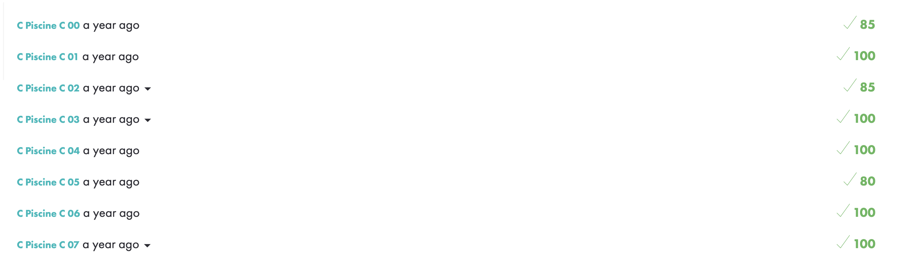
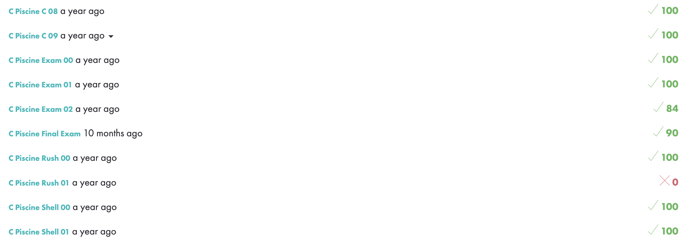

# 42 Piscine Exercises

This repository contains the solutions I provided to the Shell and C programming exercises during the 42 piscine, which is a 4-week intensive selection process for admission to 42 school. Despite the crazy challenges, it was not only one of the best experiences of my life, but also a real affirmation of my strong desire to delve deeper into computer science and explore the endless possibilities of this field!

## Table of Contents

- [About the Piscine](#about-the-piscine)
	- [Days](#days)
    - [Peer-to-peer evaluations](#peer-to-peer-evaluations)
    - [Evaluation points](#evaluation-points)
    - [Rushes](#rushes)
    - [Norm](#norm)
    - [Exams](#exams)
- [Repository Structure](#repository-structure)
- [My Grades](#my-grades)

## About the Piscine

The 42 piscine is a 4-week intensive coding bootcamp that aims to teach essential programming skills and promote a strong work ethic. The exercises are designed to challenge and push participants to improve their coding abilities, promote collaboration, and encourage creative problem-solving approaches.

#### Days
The piscine is divided into a series of "days," with each day focusing on specific programming concepts. Each day typically consists of a set of exercises, such as ex00, ex01, ex02, ex03, and so on. These exercises progressively become more complex.

There are 13 "days" projects. Participants have to validate as many "days" as they can during this entire bootcamp.

Each exercise within a "day" is evaluated based on a binary grading system, where it is either considered entirely correct or incorrect. There are no partial scores or intermediary points given for the exercises.

Participants have to accomplish as many exercises as they can within each "day" project. However, let's consider a scenario where a participant completes ex00, ex01, ex02, and ex03 of "day" C00 correctly but makes a mistake in ex04 of that "day". In this case, not only will ex04 receive a zero score, but all the next exercises will not be evaluated and marked as wrong (even though they are correct). So for this specific day, the final mark will only be the sum of points earned with ex00, ex01, ex02, and ex03.

#### Peer-to-peer evaluations
For each "day" of the bootcamp, such as C00, the evaluation process involves multiple steps. First, the participants' work is assessed by two evaluators (piscine participants) who carefully review the code and implementation. These evaluators provide their individual evaluations based on the established criteria and guidelines.

After the human evaluations, the project undergoes an additional automated assessment using a tool called the Moulinette. The Moulinette checks the project for conformity, adherence to coding standards, and additional validations.

The final grade for the day's exercises is determined by taking the average of the evaluations provided by the two evaluators and the Moulinette.

#### Evaluation points
Upon entering the piscine, participants are assigned a certain number of points. 

When participants evaluate their peers' projects, they gain points. Conversely, when participants submit their own work for evaluation, they lose points.

If a participant's point total reaches zero at any point during the piscine, they need to evaluate other participants' work, to regain points and continue to receive evaluations for their own projects.

#### Rushes
In addition to the daily exercises, the piscine includes "rushes." Rushes are group projects that require participants to work collaboratively to solve coding challenges within a limited timeframe, usually 48 hours during the weekends.

#### Norm
For each "day" and "rush" of the piscine, the code submissions undergo a verification process using a tool called norminette.

The norminette evaluates the code for various aspects, including indentation, naming conventions, comments, number of lines and other formatting rules.

Any norminette error detected in a "day" or "rush" exercise will result in a zero score for the entire "day" or "rush" project.

Please refer to the `norm.pdf` document for detailed information on the coding standards and rules enforced by the norminette.

#### Exams
The piscine also includes weekly exams.

The exams of the first three weeks last 4 hours, while the final exam during the last day lasts 8 hours.  

The exams in the piscine follow a structured approach with different levels, such as Level 0, Level 1, and so on. Each level consists of a pool of exercises from which one exercise is selected for evaluation.

To advance to the next level, participants must successfully complete the exercise assigned to their current level. If an exercise is found to have any mistakes or incompleteness, participants cannot progress to the next level until they successfully complete the exercise.

Failing a level not only prevents progression but also results in an additional waiting time before resubmitting the exercises for grading.

## Repository Structure

Projects are organized into directories. Within each "day" directory, you will find the exercises folders and their corresponding solutions. Here's an example of the directory structure:

```
├── C00
│   ├── ex00
│   ├── ex01
│   ├── ex02
│   └── ...
├── C01
│   ├── ex00
│   ├── ex01
│   ├── ex02
│   └── ...
├── C03
│   ├── ex00
│   ├── ex01
│   ├── ex02
│   └── ...
└── ...
```

I added a directory for the subjects of "Days" and "Rushes". (_I added the subject for "day" C12 even though I was not graded for it, because I learnt linked lists for the final exam_)

## My Grades

Here are my grades for the 42 piscine exercises, rushes, and exams:





